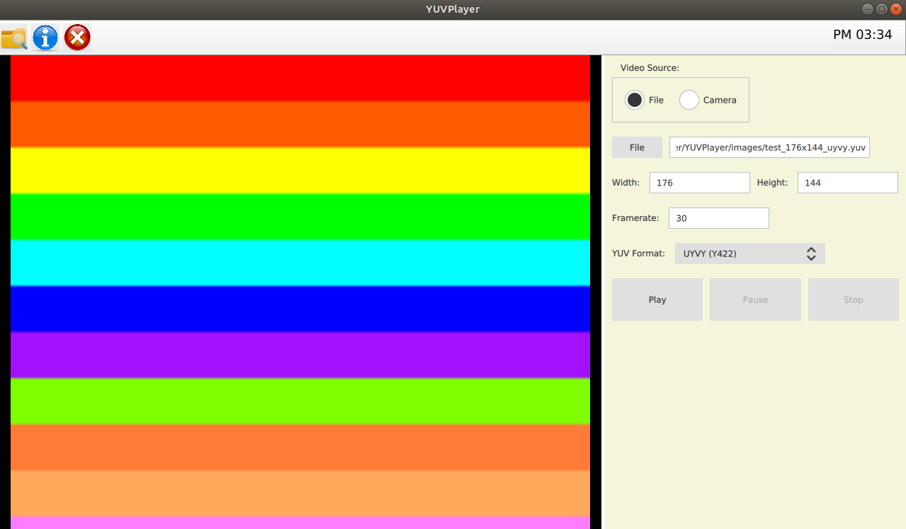

# YUV Player

A Player that shows YUV format image/video on GUI that builds by QML.



Known issues please see [here](#issues).

## Support Format

- I420 (YU12, YUV420P)
- YV12 (YUV420P)
- YUY2 (YUYV, YUV422)
- UYVY (Y422, YUV422)
- YVYU (YUV422)
- NV12 (YUV420SP)
- NV21 (YUV420SP)
- NV16 (YUV422SP)
- NV61 (YUV422)

## Usage

### 1. Enviromnent

Require:

- Qt5.10+
- CMake & Ninja

#### 1-1. Run with Docker (Recommend)

You can use the docker image that we already build, as below

```bash
$ docker pull kakalin/qt:5.12.0_opencv_gstreamer
```

And then running with docker:

```bash
$ ./docker-run.sh
```

> If you have some issues with using it, please check here or here, please check [here](https://github.com/kaka-lin/YUVPlayer/tree/main/docker)

#### 1-2. Run with local Qt

Please install Qt/QML on your local machine.

### 2. Build and Run

#### 2-1. Build

`qmake` or `CMake` choose one for building.

```bash
# qmake
$ ./build.sh

# cmake
$ ./cmake-build.sh
```

### 2-2. Run

```bash
$ ./build/YUVPlayer
```

## Others

### Enable Qt Logging Info

export QT_LOGGING_RULES=<category>[.type]=true|false

For example:

```bash
# Turn on all debug logging
$ export QT_LOGGING_LURES=*.debug=true

# Turn on all logging level of all multimedia module
$ export QT_LOGGING_LURES=qt.multimedia.*=true
```

### Enable OpenCV Logging Info

```bash
# Enable OpenCV debug message
$ export OPENCV_LOG_LEVEL=DEBUG

# Enable OpenCV VideoIO debug message
$ export OPENCV_VIDEOIO_DEBUG=1
```

## Issues

- [VideoOutput doesn't display anything with Software Backend / Renderer](https://bugreports.qt.io/browse/QTBUG-62449)

## Acknowledgements

- Thanks to [Display cv::Mat as QVideoFrame in a QML VideoOutput](https://stackoverflow.com/questions/62069201/display-cvmat-as-qvideoframe-in-a-qml-videooutput) for converting `cv::Mat` to `QVideoFrame` data type.
- Thanks to [alpqr/qt-opencv-demo](https://github.com/alpqr/qt-opencv-demo/blob/master/opencvhelper.cpp) that supply `YUVBuffer` for convert YUV format from `cv::Mat` to `QVideoFrame` data type
